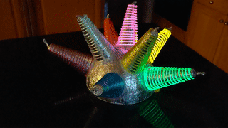
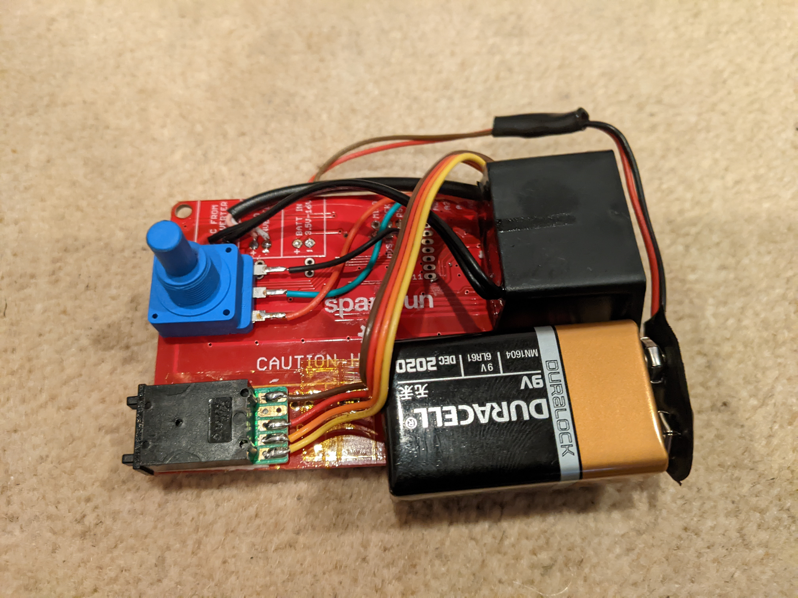
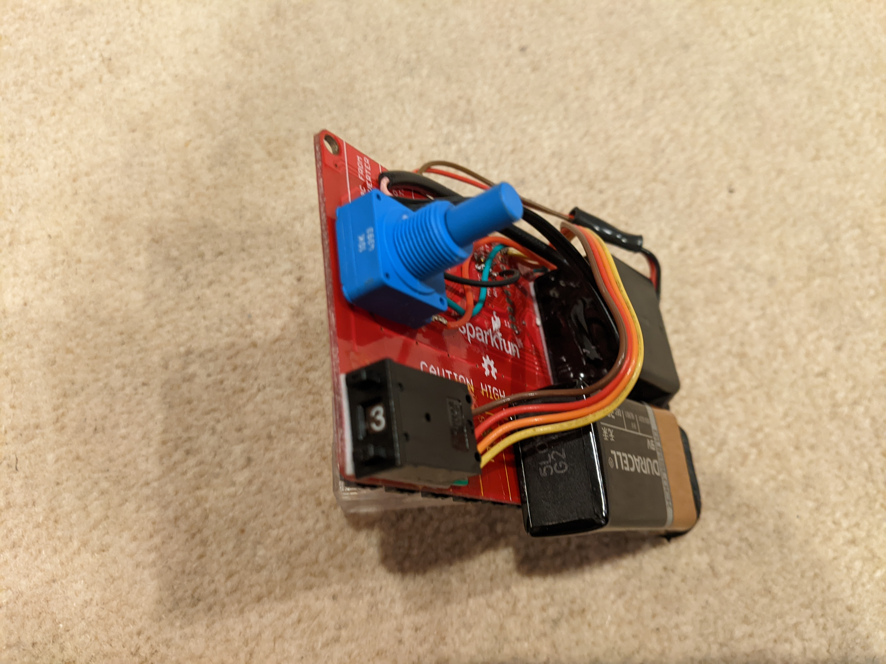
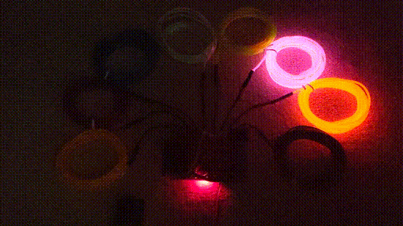
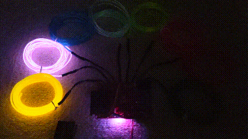

# LdgDisplay: EL Wire Driver Controller

EL Lightwire Sequence Generator using Sparkfun EL Sequencer board (COM-12781)

Christmas present for my sister.

Seven selectable patterns and random mode, and a pot for speed control.

## Hardware

* Notes
  - Board: LilyPad Arduino
  - Processor: ATMega328p
  - AdaFruit USB cable
    * Red: +5V
    * Black: GND
    * White: Rx into USB port
    * Green: Tx out of USB port
  - 3-bit selector input switch
  - 10K ohm pot for selecting speed
  - status LED (Blue) indicates start of sequence of patterns
  - runs off 9V battery for ???? hours

## Firmware

* Notes
  - Select pre-defined pattern of wires with selector switch
    * Abort pattern and go on to the new one if the selector value changes
  - Set speed with pot and base value given in the pattern defininions
  - Pattern: a set of enabled channels/wires
  - Sequence: list of Patterns with defined delays between them

## TODO

* Create a little language for defining sequences of patterns
* Write a graphical simulator to visualize patterns
* Generate a schematic
* Document things
